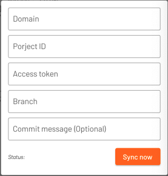

The `swagger_generator` is a library using dio interceptor to generate swagger structure automatically. It's easy and useful to create API document with less effort.

## Features

- Generate swagger json structure automatically
- Sync data to gitlab

## Getting started

- The model of the library is based on [Swagger Basic Structure](https://swagger.io/docs/specification/basic-structure/)
- Note: The library will ignore requests with base urls are outside `servers`
- By default, the response structure isn't generated. If you wanna generate response structure, set `includeResponse` as `true`
- Using gitlab API to sync to repository. You need to get the gitlab token


## Usage

### Config interceptor

Add this library to dio interceptor. To avoid redirecting the response cause interceptor doesn't log full response in your project, should add this interceptor between auth interceptor and error interceptor

```dart
Dio()
..interceptors.addAll([
    AuthInterceptor(),
    SwaggerInterceptor(),
    ErrorInterceptor(),
]);
```

### Initial plugin

[REQUIRED]

```dart
SwaggerGenerator.instance.initial(
    Swagger(
      id: 'test',
      info: const SwaggerInfo(
        title: 'API docs',
        version: '1.0.0',
      ),
      servers: [
        SwaggerServer(
          url: 'https://test.com/api',
          description: 'Test API',
        ),
      ],
      components: SwaggerComponent(
        securities: const [
          SwaggerSecurity(
            name: 'Authorization',
            type: 'http',
            scheme: 'bearer',
            bearerFormat: 'JWT',
          ),
        ],
      ),
    ),  
    includeResponse: true
  );
```

### Preview data

The library support preview json data. You can navigate to this screen by using

```dart
SwaggerGenerator.instance.openPreviewPage(context);
```

### Sync to gitlab

Input your gitlab information then you can sync latest structure to gitlab


